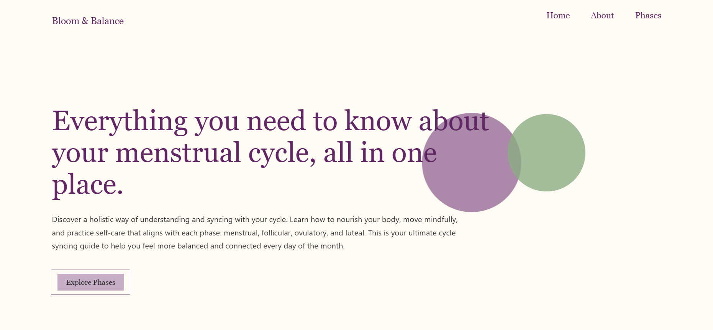

# Bloom & Balance

A guide that explains the four phases of the menstrual cycle and provides self-care, nutrition, movement, and lifestyle recommendations. Built with **HTML, CSS, and JavaScript** and includes a responsive image/text carousel using **Swiper.js**.

## Description

This project is a front-end web application designed to educate women on the menstrual cycle phases and give them recommendations for self-care practices. The site features:
- A navigation bar with smooth scrolling.
- A Swiper.js carousel to present the four menstrual phases with autoplay and pagination.
- Additional info pages linked from the carousel for more information on nutrition, herbs and teas, movement, self-care, and lifestyle.

## Visuals

### Homepage


### Carousel


### Follicular Phase Section


### Menstrual Phase Section


## Getting Started

### Dependencies

- Any web browser: Chrome, Firefox, Edge, Safari, (works best with Edge).
- OS: Works on Windows, macOS, or Linux.
- Internet connection (to fetch Swiper.js via jsDelivr CDN).

### Installing

1. Clone or download the repository:
   ```bash
   git clone https://github.com/dara-odebode/bloom-and-balance.git
2. Right-click on any .html file and choose "Open with Live Server".

## Roadmap
I'll come back to improve the website frequently as I learn more web development and UI/UX skills. I plan to host Bloom & Balance on NameCheap so more people can access it and I'm also making a case study. 

## Help
### Common issues:

- Swiper arrows not showing → Ensure you’ve included both the Swiper CSS and JS <script> links from the CDN.
- Autoplay not working → Confirm the Swiper initialization script is included at the bottom of index.html.

## Authors

Dara — @dara-odebode

## License

This project is licensed under the MIT License - see the LICENSE.md file for details.

## Acknowledgments  

Inspiration and tools:  

* [Swiper.js](https://swiperjs.com/)  
* [jsDelivr CDN](https://www.jsdelivr.com/)  
* [Herblanced](https://herblanced.com/en)
* [Kabel Mishka Ligot's Portflio](https://www.kabelmishka.com/work-v)
